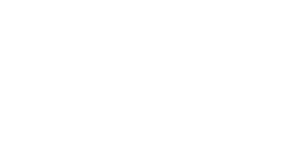

<div align="center">
    
</div>
<div align="center">
    <p align="center">
	#Kaique Gonçalves | Tech Lead & Back-end PHP Developer @Yesdev
	</p>
</div>
<div align="center">
    <a href="https://www.linkedin.com/in/developer-kaiqueg/"></a>
    <a href="https://api.whatsapp.com/send?phone=5518997855948&text=Ol%C3%A1!"></a>
    <a href="mailto:developerkaique@gmail.com"></a>
    <a href="https://www.instagram.com/kaiqueg.dev/"></a>
</div>

<h1 align="center">Sobre mim 😎</h1>

**Atualmente eu trabalho com Desenvolvimento PHP em nível Pleno, fazendo a gestão dos projetos, arquitetando software e aplicando soluções em nível técnico. Trabalho a mais de 3 anos com o framework Laravel e me considero avançado no seu uso! Em paralelo trabalho também com tecnologias para front-end e banco de dados: React.js, Bootstrap, MySQL, Github Actions.**


**Desde que tive contato com o Framework Laravel me apaixonei, me especializei na Arquitetura MVC, uso do Eloquent, implementação de teste unitários, desenvolvimento com TDD, Design Patterns, Algoritmos e Arquitetura SaaS Multi-tenant.**


**Dentre minhas soft-skills, tenho perfíl de liderança, um conhecimento substâncial em Marketing e Tráfego, GTag Manager e Analytics.**

* 🔭 **Atualmente trabalho na**: `Kaique G Desenvolvimento`.
* 🌱 **Atualmente estudando**: `postgresql`.
* 💬 **Especialidade**: `PHP`.


<h1 align="center">Habilidades</h1>

```json
{
    "skills": [
        "PHP",                   "POO",                "SQLite",                 "PSR's",
        "Laravel",               "Eloquent",           "React.js",               "Design Patterns",
        "TDD",                   "MySQL",              "Next.js",                "API RESTful",
        "Teste unitário",        "Git",                "Unix / Linux",           "Clean Code"
    ]
}
```
